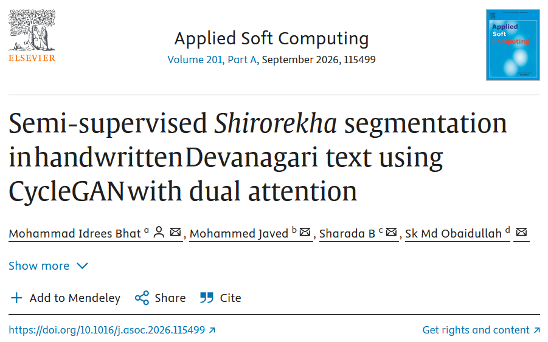

# Semi-Supervised-Shirorekha-Segmentation-CycleGAN-Dual-Attention
## Semi-Supervised Shirorekha Segmentation in Handwritten Devanagari Text using CycleGAN with Dual Attention 

---

Paper link [Click Here](https://www.sciencedirect.com/science/article/pii/S1568494626009476)

---

### Code and Dataset available [Click Here](https://github.com/idrees11/Semi-Supervised-Shirorekha-Segmentation-CycleGAN-Dual-Attention)
